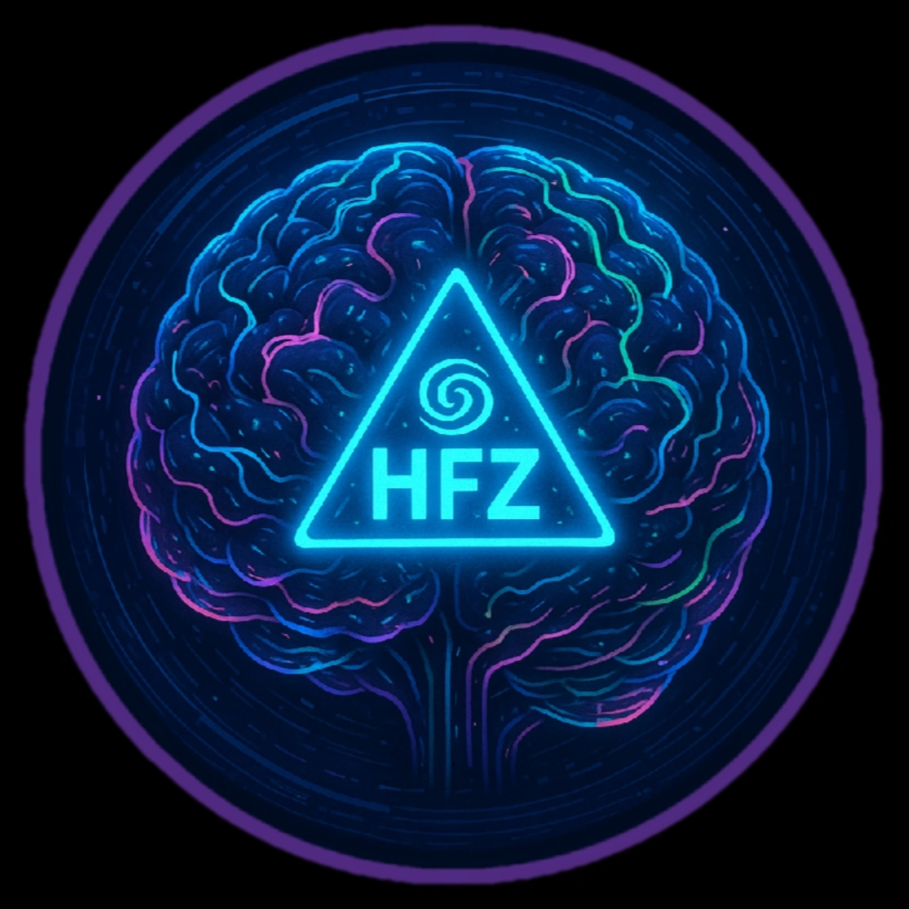

# 🐝 Hyperfocus Zone Showcase

> A playground of agents, tools, games, and experiments built by neurodivergent devs for neurodivergent devs.



This is the central community hub for the **Hyperfocus** ecosystem. It showcases builds, experiments, and tools created by @welshDog and the community.

## 🚀 Quick Start

1.  **Clone the repo**
    ```bash
    git clone https://github.com/hypercode-lab/showcase-web.git
    cd showcase-web
    ```

2.  **Install dependencies**
    ```bash
    npm install
    ```

3.  **Run the development server**
    ```bash
    npm run dev
    ```
    Open [http://localhost:3000](http://localhost:3000) to view the showcase.

## 🛠️ Tech Stack

*   **Framework**: Next.js 14+ (App Router)
*   **Styling**: Tailwind CSS v4
*   **Data**: JSON-based Registry (Zero-DB)
*   **Deployment**: Vercel

## 🤝 Contributing

Want to add your build to the showcase? It's easy!

1.  Fork this repository.
2.  Edit `data/builds.json`.
3.  Submit a Pull Request.

See [CONTRIBUTING.md](CONTRIBUTING.md) for detailed instructions.

## 📜 License

MIT © [Hyperfocus Zone](https://hyperfocus.zone)
